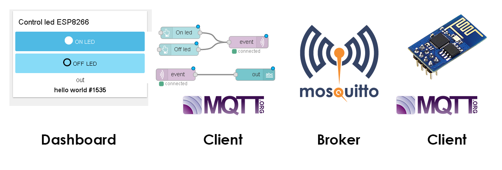
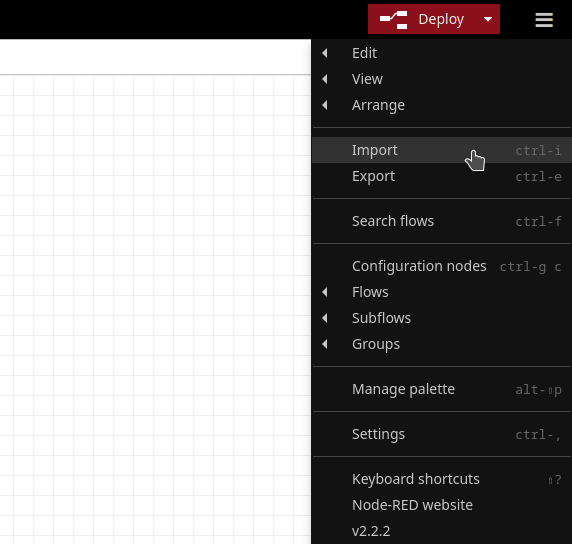
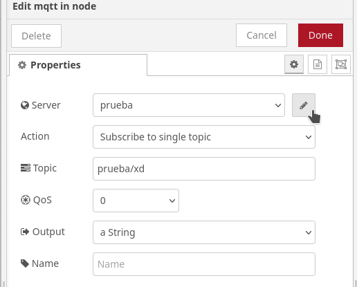
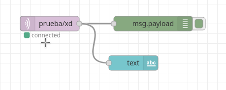
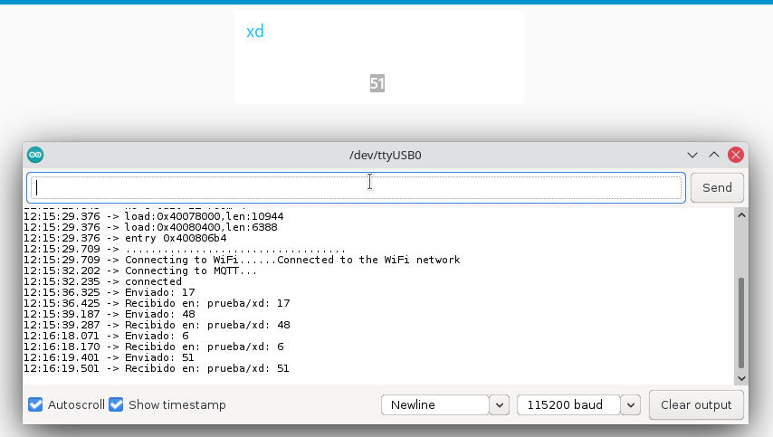

# Introduction
This reposity includes the basic information to mount a web server using **Node-RED** as a Dashboard and also working as a MQTT server using **Mosquitto**.

*Again, thanks to Andrés Perez for the first version.*

# Servidor Web y comunicación con ESP32 por medio de un broker MQTT

En este repositorio se presenta el proceso para montar un servidor web haciendo uso de Node-RED, y llevar a cabo su conexion con una tarjeta ESP32, haciendo uso del protocolo de comunicacion MQTT.

## Comunicacion

1. La comunicacion comienza en el ESP32, el cual se encarga de enviar un texto al broker MQTT por medio de una conexion de red local.

2. El broker MQTT recibe el valor y permite que otros clientes lo lean a traves de el.

3. Un servidor web ejecutado por Node-RED lee el dato recibido por el broker y ejecuta una accion de acuerdo al dato leido, en este caso esa accion es mostrar el texto en un sitio web.



Este proyecto trabaja en conjunto con un programa creado para el esp32, el cual se encuentra en el siguiente repostorio:

    http://gmarxcc.com:8088/andrespm/mqtt-server-esp32.git

# MQTT Server	

## Installing Mosquitto

For the Raspberry pi, based on Debian's distribution, we can use:

```bash
sudo apt update
sudo apt upgrade
sudo apt install mosquitto
```

To execute *mosquitto* and enable every time the system starts:

```
sudo systemctl enable mosquitto.service
```

## Configuring the Mosquitto server

First replace the default configuration file by the file providing in this repository:

```
sudo cp ./mosquitto.conf /etc/mosquitto/mosquitto.conf
```
then, create the password file instanced on the `mosquitto.conf` file

```
sudo touch /etc/mosquitto/passwd
```
finally, restart the service:

    sudo systemctl restart mosquitto

## Node-RED installation
To install **nodejs** write in terminal:
```
sudo apt update
sudo apt install nodejs
sudo apt install npm
```

Then, let us install the *Node-RED* app and the *Dashboard* complement by using the *Node Package Manager*:

```
npm install node-red
npm install node-red-dashboard
```

now, we require to run in background the app and verify that *node-RED* is running:
```
node-red &
sudo netstat -plnt
```
then, to get access to *node-RED* go to your web browser at `rasp-hostname.local:1880` or `rasp-ip:18080`.


## A flow process in Node-RED
A basic process is implemented on *Node-RED* to test the mqtt protocol. Thus, add the next blocks:

1. `mqtt in` from network group
2. `debug` from common
3. `text`from dashboard

then, double-click on `mqtt-in` to open and edit the node:


click on *Add new mqtt-brocker*, then, in the *Connection* tab: set *Name* to Rasp, point the server to the raspberry's ip or hostname and port 1883. Leave unchanged the *Security* and *Message* tabs and click on the **Add** button. 


Finally, set the topic to `data/esp32` and the output to `a String` in the mqtt properties' node:

Next, click on the `Deploy` button to check if the process can connect to the Broker:
 


how  to connect???


In the *Node-RED* App press the `import`button at the right-lower menu and upload the `flows.json` file in this repository. 




Damos clic en el nodo de mqtt in (el morado con el texto prueba/xd), se desplegara un menu con las propiedades del nodo.



Damos clic en el lapiz, el cual nos desplegara un menu con la configuracion, en el apartado de server tecleamos la direccion de nuestro server mosquitto

Una vez configurado, corremos el proceso con boton **Deploy**, en caso de haber configurado correctamente el nodo mqtt, debajo de este habra un mensaje con el texto **connected**



Como se puede apreciar, uno de los nodos es una salida de insterfaz de usuario de tipo texto. Para acceder a ella nos dirijimos al navegador y escribimos la siguiente direccion: **localhost:1880/ui**

En esta interfaz se reciben los datos enviados por otros clientes al servidor mqtt

## Recepcion de datos en DASHBOARD

Al entrar a la pagina del dashboard vemos como node-red recibe el dato y lo muestra en la interfaz de usuario



