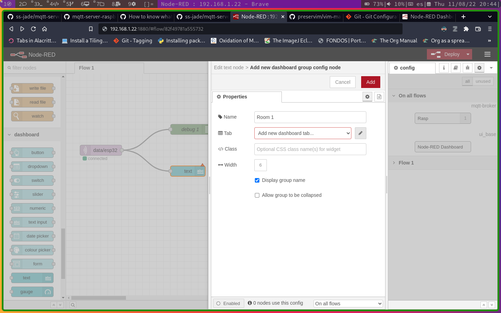

# Introduction
This reposity includes the basic information to mount a server using **Node-RED** as a Dashboard and also working as a MQTT server using **Mosquitto**. The MQTT server is tested with a ESP32 client to publish random numbers every two seconds.

The general scheme is shown below, the complete environment requires a client, mqtt server or broker, and a mqtt client that works like a user interface (dashboard).

The basic communication scheme could work like:  

1. The ESP32 starts the communication chain by sending a text message to the broker, the broker can be public or local.

2. Depending on the code, the sending message can be replicated to all the connected clients in the *topic*.

3. Finally, a web server based on *Node-RED* will read the publicated data in the broker to be displayed in the *UI*.


The client code to test the environment is hosted in the [mqtt-client-esp32-v2](https://github.com/ss-jade/mqtt-client-esp32-v2).

*Thanks to Andrés Perez for the first version.*

# MQTT Server	

## Installing Mosquitto

For the Raspberry pi, based on Debian's distribution, we can use:

```bash
sudo apt update
sudo apt upgrade
sudo apt install mosquitto
```

To execute *mosquitto* and enable every time the system starts:

```
sudo systemctl enable mosquitto.service
```

## Configuring the Mosquitto server

First replace the default configuration file by the file providing in this repository:

```
sudo cp ./mosquitto.conf /etc/mosquitto/mosquitto.conf
```
then, create the password file instanced on the `mosquitto.conf` file

```
sudo touch /etc/mosquitto/passwd
```
finally, restart the service:

    sudo systemctl restart mosquitto

## Node-RED installation
To install **nodejs** write in terminal:
```
sudo apt update
sudo apt install nodejs
sudo apt install npm
```

Then, let us install the *Node-RED* app and the *Dashboard* complement by using the *Node Package Manager*:

```
npm install node-red
npm install node-red-dashboard
```

now, we require to run in background the app and verify that *node-RED* is running:
```
node-red &
sudo netstat -plnt
```
then, to get access to *node-RED* go to your web browser at `rasp-hostname.local:1880` or `rasp-ip:18080`.


## A flow process in Node-RED
A basic process is implemented on *Node-RED* to test the mqtt protocol. Thus, add the next blocks:

1. `mqtt in` from network group
2. `debug` from common
3. `text`from dashboard

then, double-click on `mqtt-in` to open and edit the node:


click on *Add new mqtt-brocker*, then, in the *Connection* tab: set *Name* to Rasp, point the server to the raspberry's ip or hostname and port 1883. Leave unchanged the *Security* and *Message* tabs and click on the **Add** button. 


Finally, set the topic to `data/esp32` and the output to `a String` in the mqtt properties' node:

Next, connect the blocks as shows in the image and click on the `Deploy` button to check if the process can connect to the Broker:
 

## Creating the UI
Next, make double-click on the `dashboard-text` node and add a new `Group` by click on the pencil icon:



set the name *Project*, and add also a new `Dashboard tab`, do not change the default names:


once the parameters have been configured click the add button twice; for the tabs and for the node properties. Next, click on the `Deploy` button and visit the `hostname-or-ip/ui` to see the output generated by the MQTT client:


**Note: you can also check the generated data on the Arduino IDE serial tools.**
